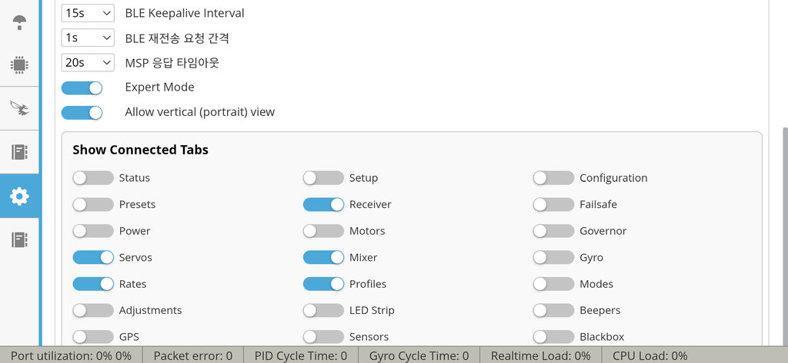
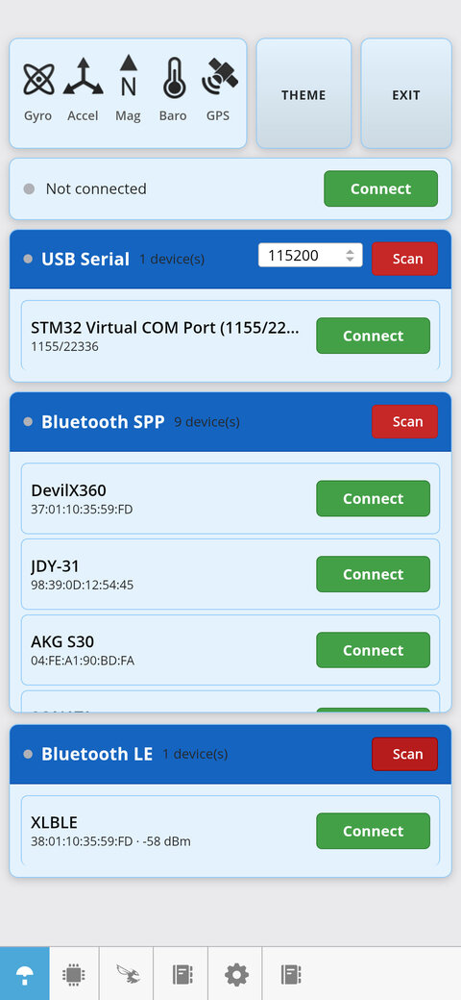
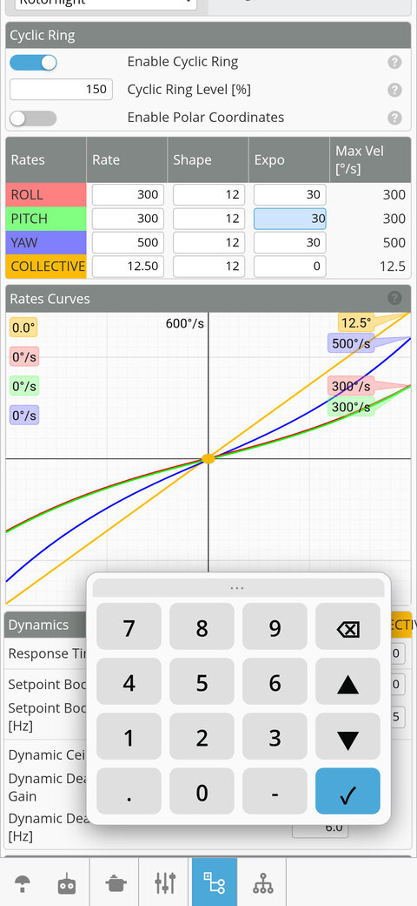
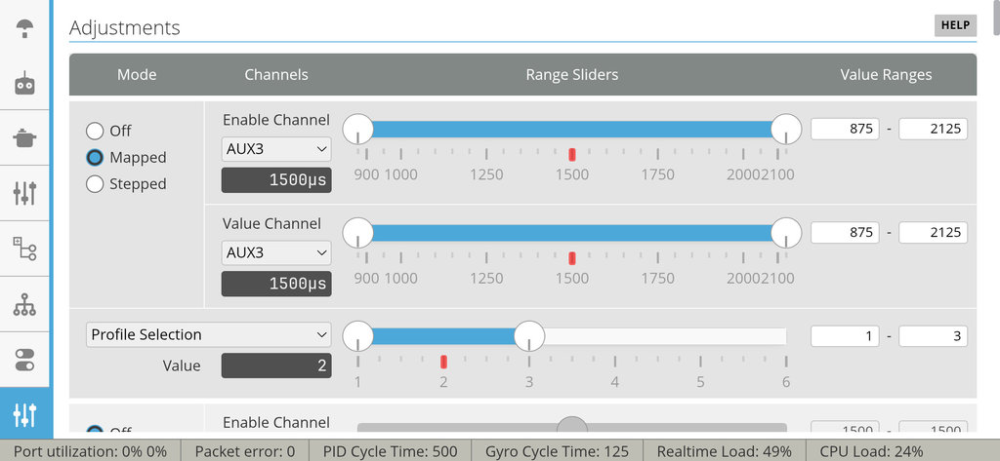

## Download

The latest Android APK build is available here:

[rf-cordova.apk](https://github.com/saydals/rf/raw/master/redist/rf-cordova.apk)

(Enable "Install unknown apps" on your device to install it.)

## Mobile UI (notes on this fork)

**Key Features**

1. **Bluetooth support**
2. **Unnecessary screens cleaned up**
3. **Icon optimization**
4. **Option to show only the tabs you need**
5. **Added a convenient input method**

**Notes**

> When connecting to a BLE module such as SpeedyBee, a "Data loading" popup may appear; depending on the situation it can take anywhere from a few seconds to tens of seconds. While background data is still being received, touching the screen will simply dismiss it. Force-closing it and then switching tabs greatly increases the risk of a crash. BLE module speeds vary — SpeedyBee is a module optimized for Betaflight, so for Rotorflight we recommend using a different BLE module instead. SPP remains the better choice.

The actual core functionality is unchanged — only the connection part and the UI were modified, so there should be no functional errors. To make better use of the narrow screen, unnecessary elements are hidden.

The screenshot section is a newly added Options item. Of the 22 feature tabs, only about 3–4 are actually used at the flying field.



Connection capability was added to the Connect tab. On an X360 helicopter with one Bluetooth module attached and USB also connected, you can connect to any of USB / SPP / BLE as shown below. BLE is slower compared to the others, but it has been brought up to a usable level.

Portrait orientation is now supported. In portrait the icons are placed along the bottom. The icon shapes and behavior were made easier to use.



After connection, the number of icons is reduced so they are easy to find and click. When many tabs are in use, horizontal scrolling auto-centers the icons.

The originally large system keyboard was replaced with a custom input method. When you touch an input field, it automatically moves out of the way and appears at the bottom. Touching the input box at the bottom of the screen → auto-scrolls up → pops up at the lower position. If you drag it elsewhere, it stays fixed at the new location.



For tabs that need a wide screen, viewing in landscape as shown below lets you see everything without it being cut off.



---

# Rotorflight Configurator

[Rotorflight](https://github.com/rotorflight) is a Flight Control software suite designed for
single-rotor helicopters. It consists of:

- Rotorflight Flight Controller Firmware
- Rotorflight Configurator, for flashing and configuring the flight controller (this repository)
- Rotorflight Blackbox Explorer, for analyzing blackbox flight logs
- Rotorflight LUA Scripts, for configuring the flight controller using a transmitter

Built on Betaflight 4.3, Rotorflight incorporates numerous advanced features specifically
tailored for helicopters. It's important to note that Rotorflight does _not_ support multi-rotor
crafts or airplanes; it's exclusively designed for RC helicopters.

This version of Rotorflight is also known as **Rotorflight 2** or **RF2**.


## Information

Tutorials, documentation, and flight videos can be found on the [Rotorflight website](https://www.rotorflight.org/).


## Installation

Please download the latest version from [github](https://github.com/rotorflight/rotorflight-configurator/releases/).


## Features

Rotorflight has many features:

* Many receiver protocols: CRSF, S.BUS, F.Port, DSM, IBUS, XBUS, EXBUS, GHOST, CPPM
* Support for various telemetry protocols: CSRF, S.Port, HoTT, etc.
* ESC telemetry protocols: BLHeli32, Hobbywing, Scorpion, Kontronik, OMP Hobby, ZTW, APD, YGE
* Advanced PID control tuned for helicopters
* Stabilisation modes (6D)
* Rotor speed governor
* Motorised tail support with Tail Torque Assist (TTA, also known as TALY)
* Remote configuration and tuning with the transmitter
  - With knobs / switches assigned to functions
  - With LUA scripts on EdgeTX, OpenTX and Ethos
* Extra servo/motor outputs for AUX functions
* Fully customisable servo/motor mixer
* Sensors for battery voltage, current, BEC, etc.
* Advanced gyro filtering
  - Dynamic RPM based notch filters
  - Dynamic notch filters based on FFT
  - Dynamic LPF
* High-speed Blackbox logging

Plus lots of features inherited from Betaflight:

* Configuration profiles for changing various tuning parameters
* Rates profiles for changing the stick feel and agility
* Multiple ESC protocols: PWM, DSHOT, Multishot, etc.
* Configurable buzzer sounds
* Multi-color RGB LEDs
* GPS support

And many more...


## Notes

#### Windows

Rotorflight Configurator requires Windows 10 or later. Windows 7 is not supported.

Windows has sometimes issues with detecting the flight controller USB device correctly.
Impulse RC has created a _Driver Fixer_ software for fixing these issues. You can download it
[here](https://impulserc.com/pages/downloads).

#### Linux

In most Linux distributions your user won't have access to serial interfaces by default.
To add this access right type the following command in a terminal, then log out and log in again:

```
sudo usermod -aG dialout ${USER}
```

#### Graphics Issues

If you experience graphics display problems or smudged/dithered fonts display issues in Rotorflight Configurator, try invoking the `rotorflight-configurator` executable file with the `--disable-gpu` command line switch. This will switch off hardware graphics acceleration. Likewise, setting your graphics card antialiasing option to OFF (e.g. FXAA parameter on NVidia graphics cards) might be a remedy as well.


## Contributing

Rotorflight is an open-source community project. Anybody can join in and help to make it better by:

* helping other users on Rotorflight Discord or other online forums
* [reporting](https://github.com/rotorflight?tab=repositories) bugs and issues, and suggesting improvements
* testing new software versions, new features and fixes; and providing feedback
* participating in discussions on new features
* create or update content on the [Website](https://www.rotorflight.org)
* [contributing](https://www.rotorflight.org/docs/Contributing/intro) to the software development - fixing bugs, implementing new features and improvements
* [translating](https://www.rotorflight.org/docs/Contributing/intro#translations) Rotorflight Configurator into a new language, or helping to maintain an existing translation


## Origins

Rotorflight is software that is **open source** and is available free of charge without warranty.

Rotorflight is forked from [Betaflight](https://github.com/betaflight), which in turn is forked from [Cleanflight](https://github.com/cleanflight).
Rotorflight borrows ideas and code also from [HeliFlight3D](https://github.com/heliflight3d/), another Betaflight fork for helicopters.

Big thanks to everyone who has contributed along the journey!


## Contact

Team Rotorflight can be contacted by email at rotorflightfc@gmail.com.
